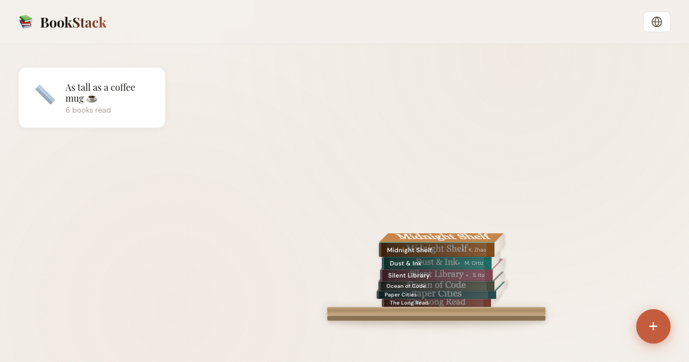

# 📚 BookStack

**BookStack** in a beautiful 3D spine-first horizontal book stack application! Built with plain HTML, CSS, JavaScript, and Vite, this web app gives readers a visual, tangible, and aesthetic way to track their reading journeys.

 *(Add a screenshot here later)*

## ✨ Features

- **Spine-First 3D Redering:** Books stack horizontally with a 2.5D CSS skew method, displaying their title/author on the spine and mimicking an isometric perspective.
- **Realistic Spines:** Instead of simple solid blocks, BookStack fetches real book covers from the Open Library API and applies them dynamically to the spine shapes, resulting in completely authentic, gorgeous-looking stacks!
- **Variable Dimensions:** Dimensions (width, thickness, page edges) adapt organically based on each book's real-world page count and title.
- **Fun Scale Comparisons:** Watch your reading stack grow and compare its physical thickness to real-world objects like coffee mugs or dining chairs!
- **Bilingual (EN/ZH):** Supports complete English and Simplified Chinese localizations.
- **Local Persistence:** Data is securely saved to your browser's `localStorage` so your stack never disappears.

## 🚀 Quick Start

Ensure you have [Node.js](https://nodejs.org/) installed, then follow these simple steps:

1. **Clone the repository**
   ```bash
   git clone https://github.com/your-username/BookStack.git
   cd BookStack
   ```

2. **Install dependencies**
   ```bash
   npm install
   ```

3. **Run the development server**
   ```bash
   npm run dev
   ```

   Then open the provided local URL (typically `http://localhost:5173/`) in your browser to see the app!

4. **Build for production**
   ```bash
   npm run build
   ```
   *The optimized static output will be available in the `dist/` directory.*

## 🛠️ Technology Stack

- **Core:** Vanilla JavaScript (ESModules), HTML5, CSS3
- **Styling:** Advanced 2.5D CSS Transforms (Skew/Scale), CSS Variables
- **Tooling:** [Vite](https://vitejs.dev/)
- **Data Source:** [Open Library API](https://openlibrary.org/developers/api)

## 🎨 Theme & Typography

- **Colors:** A very warm, editorial profile (`#f4f0eb` backgrounds and rich accents) gives the application a cozy, library-like atmosphere.
- **Typefaces:** Includes **Playfair Display** for high-contrast stylish headings and stats, paired with **DM Sans** for legible UI and spine labels.

## 🤝 Contributing

Contributions, issues, and feature requests are welcome!

## 📜 License

[MIT](LICENSE)
